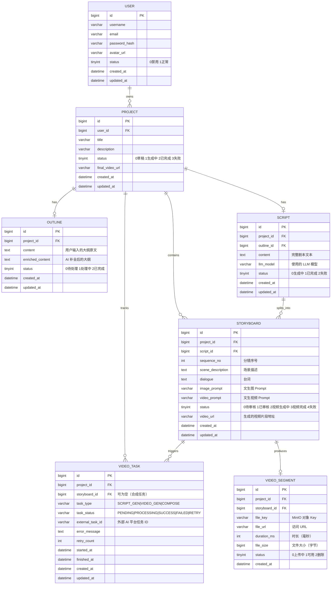
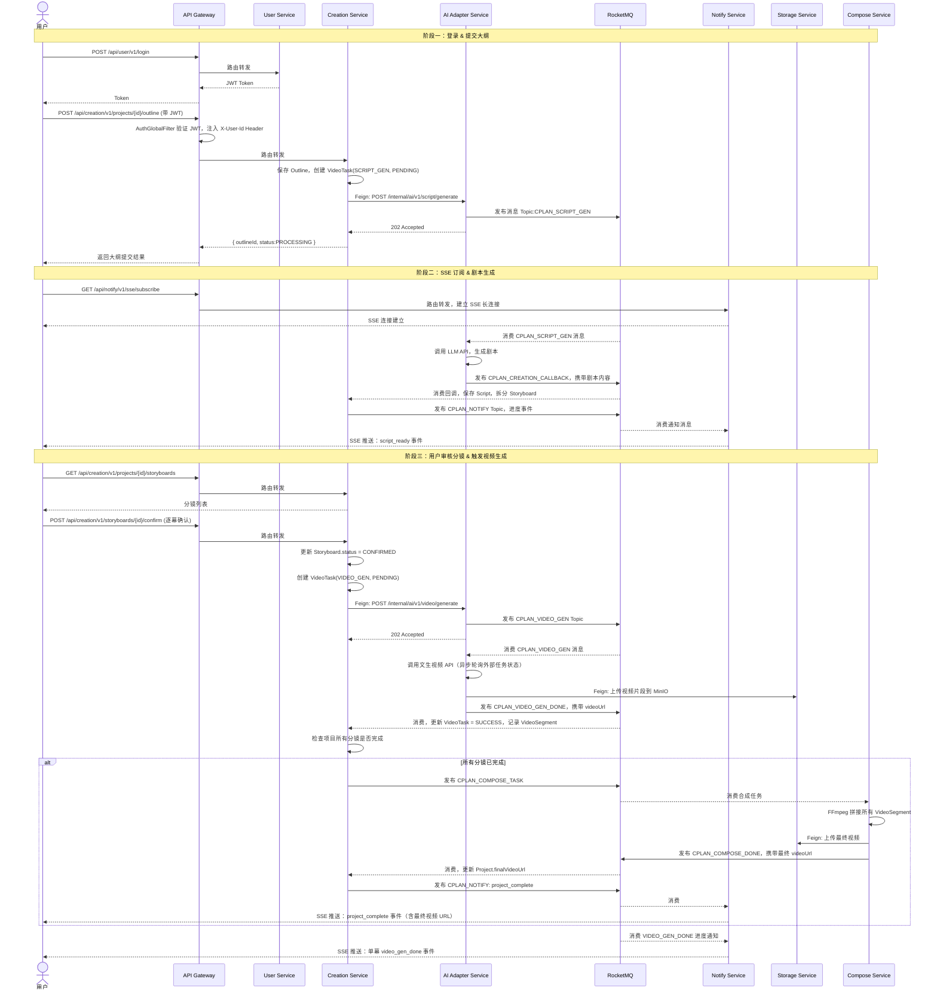
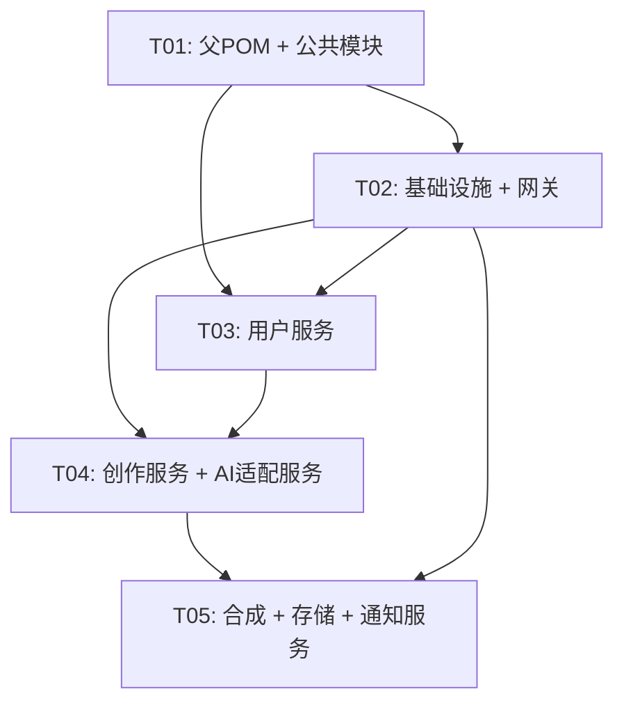

# cplan-cloud 系统架构设计文档

> 版本：1.0.0 | 作者：架构师高见远 | 日期：2025-07

---

## 目录

1. [技术选型与实现方案](#1-技术选型与实现方案)
2. [项目文件结构](#2-项目文件结构)
3. [核心数据结构](#3-核心数据结构)
4. [关键接口定义](#4-关键接口定义)
5. [核心调用时序图](#5-核心调用时序图)
6. [任务列表](#6-任务列表)
7. [依赖包列表](#7-依赖包列表)
8. [共享知识与跨服务约定](#8-共享知识与跨服务约定)
9. [待明确事项](#9-待明确事项)

---

## 1. 技术选型与实现方案

### 1.1 核心技术栈

| 层次 | 技术选型 | 版本 | 说明 |
|------|---------|------|------|
| 基础框架 | Spring Boot | 4.0.6 | 主框架 |
| 微服务编排 | Spring Cloud | 2025.1.1 | 服务治理套件 |
| 阿里巴巴扩展 | Spring Cloud Alibaba | 2025.1.0.0 | Nacos/Sentinel 集成 |
| 注册中心 | Nacos | 2.3.x | 服务注册与发现 |
| 配置中心 | Nacos Config | 2.3.x | 动态配置下发 |
| API 网关 | Spring Cloud Gateway | 4.x | 路由/鉴权/限流 |
| 服务间通信 | OpenFeign + LoadBalancer | 4.x | 声明式 HTTP 客户端 |
| 消息队列 | RocketMQ | 5.1.x | 异步任务解耦 |
| 数据库 | MySQL | 8.0 | 每服务独立 schema |
| ORM | MyBatis-Plus | 3.5.x | 简化 CRUD |
| 缓存 | Redis | 7.x | 令牌缓存/分布式锁 |
| 文件存储 | MinIO | RELEASE.2024 | 自建对象存储 |
| 任务进度推送 | SSE (Server-Sent Events) | - | 单向服务端推流 |
| 熔断限流 | Sentinel | 1.8.x | 防雪崩 |
| JWT | jjwt | 0.12.x | Token 签发与验证 |
| 视频合成 | FFmpeg + JavaCV | 0.8.x | FFmpeg Java 封装 |
| 容器化 | Docker + Docker Compose | - | 开发/测试环境 |
| Java 版本 | Java | 17 | LTS 版本 |

### 1.2 架构模式

采用 **微服务架构（MSA）+ 事件驱动架构（EDA）** 混合模式：

- **同步链路**：用户请求 → Gateway → 业务服务（OpenFeign），适合低延迟操作（注册、登录、查询）
- **异步链路**：视频生成等耗时操作走 RocketMQ，任务状态机（PENDING → PROCESSING → SUCCESS/FAILED）管理全生命周期
- **推送链路**：Notify Service 持有 SSE 连接，消费 MQ 消息后推送进度给前端

### 1.3 核心难点与对策

| 难点 | 对策 |
|------|------|
| AI 外部 API 超时长（分钟级） | 异步任务 + RocketMQ + 状态机，前端 SSE 长轮询 |
| 分镜粒度任务并发 | RocketMQ 并发消费，每个分镜独立 VideoTask，状态独立管理 |
| 单幕重新生成 | VideoTask 绑定 storyboard_id，支持独立重跑 |
| 文件大小/上传超时 | MinIO 分片上传 + 预签名 URL，客户端直传 |
| Token 鉴权跨服务 | Gateway 统一验证 JWT，下游服务读取 Header 中的用户信息 |
| FFmpeg 合成内存压力 | Compose Service 独立部署，流式处理，资源隔离 |

### 1.4 服务端口规划

| 服务 | 端口 |
|------|------|
| API Gateway | 8080 |
| User Service | 8081 |
| Creation Service | 8082 |
| AI Adapter Service | 8083 |
| Compose Service | 8084 |
| Storage Service | 8085 |
| Notify Service | 8086 |
| Nacos Server | 8848 |
| RocketMQ NameServer | 9876 |
| RocketMQ Broker | 10911 |
| MySQL | 3306 |
| Redis | 6379 |
| MinIO API | 9000 |
| MinIO Console | 9001 |

---

## 2. 项目文件结构

```
cplan-cloud/
├── pom.xml                                          # 父 POM（BOM 管理）
├── docker-compose.yml                               # 开发环境基础设施
├── docker-compose-services.yml                      # 微服务容器编排
├── .gitignore
├── README.md
│
├── cplan-common/                                    # 公共模块（无 Spring Boot 启动类）
│   ├── pom.xml
│   └── src/main/java/com/cplan/common/
│       ├── result/
│       │   ├── Result.java                          # 统一响应体 Result<T>
│       │   └── ResultCode.java                      # 业务错误码枚举
│       ├── exception/
│       │   ├── BizException.java                    # 业务异常基类
│       │   └── GlobalExceptionHandler.java          # 全局异常处理（@RestControllerAdvice）
│       ├── util/
│       │   ├── JwtUtil.java                         # JWT 工具类
│       │   └── DateUtil.java                        # 日期工具类（UTC）
│       ├── constant/
│       │   ├── MqTopicConstant.java                 # RocketMQ Topic/Tag 常量
│       │   └── RedisKeyConstant.java                # Redis Key 前缀常量
│       └── dto/
│           └── UserContextDTO.java                  # 跨服务用户上下文（从 Header 解析）
│
├── cplan-gateway/                                   # API 网关
│   ├── pom.xml
│   └── src/main/
│       ├── java/com/cplan/gateway/
│       │   ├── GatewayApplication.java              # 启动类
│       │   └── filter/
│       │       ├── AuthGlobalFilter.java            # JWT 鉴权全局过滤器
│       │       └── RequestLogFilter.java            # 请求日志过滤器
│       └── resources/
│           ├── bootstrap.yml                        # Nacos 地址
│           └── application.yml                      # 路由规则 + Sentinel 配置
│
├── cplan-user/                                      # 用户服务
│   ├── pom.xml
│   └── src/main/
│       ├── java/com/cplan/user/
│       │   ├── UserApplication.java                 # 启动类
│       │   ├── controller/
│       │   │   └── UserController.java              # 注册、登录、用户信息
│       │   ├── service/
│       │   │   ├── UserService.java                 # 接口
│       │   │   └── impl/UserServiceImpl.java        # 实现
│       │   ├── entity/
│       │   │   └── User.java                        # 用户实体
│       │   ├── mapper/
│       │   │   └── UserMapper.java                  # MyBatis-Plus Mapper
│       │   └── dto/
│       │       ├── RegisterRequest.java
│       │       ├── LoginRequest.java
│       │       └── LoginResponse.java
│       └── resources/
│           ├── bootstrap.yml
│           ├── application.yml
│           └── mapper/UserMapper.xml
│
├── cplan-creation/                                  # 创作服务
│   ├── pom.xml
│   └── src/main/
│       ├── java/com/cplan/creation/
│       │   ├── CreationApplication.java             # 启动类
│       │   ├── controller/
│       │   │   ├── OutlineController.java           # 大纲管理
│       │   │   ├── ScriptController.java            # 剧本管理
│       │   │   └── StoryboardController.java        # 分镜管理
│       │   ├── service/
│       │   │   ├── OutlineService.java
│       │   │   ├── ScriptService.java
│       │   │   ├── StoryboardService.java
│       │   │   └── impl/
│       │   │       ├── OutlineServiceImpl.java
│       │   │       ├── ScriptServiceImpl.java
│       │   │       └── StoryboardServiceImpl.java
│       │   ├── entity/
│       │   │   ├── Project.java
│       │   │   ├── Outline.java
│       │   │   ├── Script.java
│       │   │   ├── Storyboard.java
│       │   │   └── VideoTask.java
│       │   ├── mapper/
│       │   │   ├── ProjectMapper.java
│       │   │   ├── OutlineMapper.java
│       │   │   ├── ScriptMapper.java
│       │   │   ├── StoryboardMapper.java
│       │   │   └── VideoTaskMapper.java
│       │   ├── feign/
│       │   │   └── AiAdapterFeignClient.java        # 调用 AI Adapter 的 Feign 客户端
│       │   ├── mq/
│       │   │   └── VideoTaskProducer.java           # RocketMQ 消息生产者
│       │   └── statemachine/
│       │       └── VideoTaskStateMachine.java       # 视频任务状态机
│       └── resources/
│           ├── bootstrap.yml
│           ├── application.yml
│           └── mapper/
│               ├── ProjectMapper.xml
│               ├── OutlineMapper.xml
│               ├── ScriptMapper.xml
│               ├── StoryboardMapper.xml
│               └── VideoTaskMapper.xml
│
├── cplan-ai-adapter/                                # AI 适配服务
│   ├── pom.xml
│   └── src/main/
│       ├── java/com/cplan/ai/
│       │   ├── AiAdapterApplication.java            # 启动类
│       │   ├── controller/
│       │   │   └── AiAdapterController.java         # 内部 API（Feign 调用入口）
│       │   ├── service/
│       │   │   ├── LlmService.java                  # LLM 调用接口
│       │   │   ├── VideoGenService.java             # 文生视频调用接口
│       │   │   └── impl/
│       │   │       ├── LlmServiceImpl.java          # 对接 OpenAI/通义/DeepSeek
│       │   │       └── VideoGenServiceImpl.java     # 对接即梦/可灵等
│       │   ├── mq/
│       │   │   ├── ScriptGenConsumer.java           # 消费剧本生成任务
│       │   │   └── VideoGenConsumer.java            # 消费视频生成任务
│       │   └── config/
│       │       ├── LlmConfig.java                   # LLM API Key 配置
│       │       └── RetryConfig.java                 # 重试策略
│       └── resources/
│           ├── bootstrap.yml
│           └── application.yml
│
├── cplan-compose/                                   # 视频合成服务
│   ├── pom.xml
│   └── src/main/
│       ├── java/com/cplan/compose/
│       │   ├── ComposeApplication.java              # 启动类
│       │   ├── controller/
│       │   │   └── ComposeController.java           # 合成接口（供 Feign 调用）
│       │   ├── service/
│       │   │   ├── VideoComposeService.java
│       │   │   └── impl/VideoComposeServiceImpl.java
│       │   ├── mq/
│       │   │   └── ComposeTaskConsumer.java         # 消费合成任务
│       │   └── util/
│       │       └── FFmpegUtil.java                  # FFmpeg 命令封装
│       └── resources/
│           ├── bootstrap.yml
│           └── application.yml
│
├── cplan-storage/                                   # 存储服务
│   ├── pom.xml
│   └── src/main/
│       ├── java/com/cplan/storage/
│       │   ├── StorageApplication.java              # 启动类
│       │   ├── controller/
│       │   │   └── StorageController.java           # 上传、下载、预签名 URL
│       │   ├── service/
│       │   │   ├── StorageService.java
│       │   │   └── impl/MinioStorageServiceImpl.java
│       │   └── config/
│       │       └── MinioConfig.java                 # MinIO 客户端配置
│       └── resources/
│           ├── bootstrap.yml
│           └── application.yml
│
├── cplan-notify/                                    # 通知服务
│   ├── pom.xml
│   └── src/main/
│       ├── java/com/cplan/notify/
│       │   ├── NotifyApplication.java               # 启动类
│       │   ├── controller/
│       │   │   └── SseController.java               # SSE 订阅端点
│       │   ├── service/
│       │   │   ├── SseService.java
│       │   │   └── impl/SseServiceImpl.java
│       │   └── mq/
│       │       └── NotifyMessageConsumer.java       # 消费通知消息 → 推送 SSE
│       └── resources/
│           ├── bootstrap.yml
│           └── application.yml
│
└── sql/
    ├── cplan_user.sql                               # 用户库建表脚本
    ├── cplan_creation.sql                           # 创作库建表脚本
    └── cplan_storage.sql                            # 存储元数据库建表脚本
```

---

## 3. 核心数据结构

### 3.1 ER 图（Mermaid）



### 3.2 核心类图（Mermaid）

```mermaid
classDiagram
    class Result~T~ {
        +int code
        +String message
        +T data
        +static Result~T~ ok(T data)
        +static Result~T~ fail(ResultCode code)
        +static Result~T~ fail(int code, String message)
    }

    class ResultCode {
        <<enumeration>>
        SUCCESS(200)
        UNAUTHORIZED(401)
        FORBIDDEN(403)
        NOT_FOUND(404)
        BIZ_ERROR(1000)
        AI_INVOKE_ERROR(2000)
        COMPOSE_ERROR(3000)
    }

    class UserService {
        +Result register(RegisterRequest req)
        +Result~LoginResponse~ login(LoginRequest req)
        +Result~UserDTO~ getUserInfo(Long userId)
    }

    class CreationService {
        +Result~ProjectVO~ createProject(Long userId, CreateProjectRequest req)
        +Result~OutlineVO~ submitOutline(Long projectId, SubmitOutlineRequest req)
        +Result~ScriptVO~ getScript(Long projectId)
        +Result~List~StoryboardVO~~ listStoryboards(Long projectId)
        +Result confirmStoryboard(Long storyboardId)
        +Result regenerateStoryboard(Long storyboardId)
    }

    class AiAdapterService {
        +Result triggerScriptGen(ScriptGenRequest req)
        +Result triggerVideoGen(VideoGenRequest req)
        +Result~TaskStatusVO~ queryTaskStatus(String externalTaskId)
    }

    class VideoTaskStateMachine {
        +void transition(VideoTask task, TaskEvent event)
        +boolean canTransit(String currentStatus, TaskEvent event)
    }

    class SseService {
        +SseEmitter subscribe(Long userId)
        +void pushEvent(Long userId, SseEventDTO event)
        +void remove(Long userId)
    }

    class StorageService {
        +Result~PresignedUrlVO~ generateUploadUrl(String bucket, String key)
        +Result~PresignedUrlVO~ generateDownloadUrl(String bucket, String key)
        +void deleteObject(String bucket, String key)
    }

    class FFmpegUtil {
        +void concatVideos(List~String~ inputPaths, String outputPath)
        +void addAudio(String videoPath, String audioPath, String outputPath)
        +VideoMetaDTO getMetadata(String filePath)
    }

    CreationService --> VideoTaskStateMachine : uses
    CreationService --> AiAdapterService : feign calls
    SseService --> SseEmitter : manages
```



---

## 4. 关键接口定义

### 4.1 User Service（端口 8081）

#### POST `/api/user/v1/register` — 用户注册
```json
// Request
{
  "username": "string",       // 用户名，3-20字符
  "email": "string",          // 邮箱
  "password": "string"        // 明文密码（传输加密）
}

// Response Result<Void>
{
  "code": 200,
  "message": "success",
  "data": null
}
```

#### POST `/api/user/v1/login` — 用户登录
```json
// Request
{
  "email": "string",
  "password": "string"
}

// Response Result<LoginResponse>
{
  "code": 200,
  "data": {
    "accessToken": "eyJhbGci...",
    "tokenType": "Bearer",
    "expiresIn": 86400,
    "userId": 10001,
    "username": "张三"
  }
}
```

#### GET `/api/user/v1/info` — 获取当前用户信息（需 JWT）
```json
// Response Result<UserDTO>
{
  "code": 200,
  "data": {
    "id": 10001,
    "username": "张三",
    "email": "zhangsan@example.com",
    "avatarUrl": "https://..."
  }
}
```

---

### 4.2 Creation Service（端口 8082）

#### POST `/api/creation/v1/projects` — 创建项目
```json
// Request
{
  "title": "我的第一个短视频",
  "description": "科技风格，讲述 AI 发展"
}
// Response Result<ProjectVO>
{ "code": 200, "data": { "projectId": 20001, "status": "DRAFT" } }
```

#### POST `/api/creation/v1/projects/{projectId}/outline` — 提交大纲（触发异步生成）
```json
// Request
{
  "content": "第一幕：AI 诞生...\n第二幕：..."
}
// Response Result<OutlineVO>
{ "code": 200, "data": { "outlineId": 30001, "status": "PROCESSING" } }
```

#### GET `/api/creation/v1/projects/{projectId}/script` — 获取剧本
```json
// Response Result<ScriptVO>
{
  "code": 200,
  "data": {
    "scriptId": 40001,
    "content": "完整剧本文本...",
    "status": "COMPLETED"
  }
}
```

#### GET `/api/creation/v1/projects/{projectId}/storyboards` — 获取分镜列表
```json
// Response Result<List<StoryboardVO>>
{
  "code": 200,
  "data": [
    {
      "id": 50001,
      "sequenceNo": 1,
      "sceneDescription": "城市全景...",
      "dialogue": "旁白：...",
      "videoPrompt": "cinematic city skyline...",
      "status": "PENDING_REVIEW",
      "videoUrl": null
    }
  ]
}
```

#### POST `/api/creation/v1/storyboards/{storyboardId}/confirm` — 确认分镜（触发视频生成）
```json
// Response Result<Void>
{ "code": 200, "data": null }
```

#### POST `/api/creation/v1/storyboards/{storyboardId}/regenerate` — 重新生成单幕视频
```json
// Request（可选，覆盖 Prompt）
{
  "videoPrompt": "新的 prompt（可选）"
}
// Response Result<VideoTaskVO>
{ "code": 200, "data": { "taskId": 60001, "status": "PENDING" } }
```

---

### 4.3 AI Adapter Service（端口 8083）— 内部 Feign 接口

#### POST `/internal/ai/v1/script/generate` — 触发剧本生成
```json
// Request
{
  "projectId": 20001,
  "outlineId": 30001,
  "outlineContent": "大纲内容...",
  "llmModel": "deepseek-chat"
}
// Response Result<Void>
{ "code": 200, "data": null }
```

#### POST `/internal/ai/v1/video/generate` — 触发单幕视频生成
```json
// Request
{
  "projectId": 20001,
  "storyboardId": 50001,
  "videoTaskId": 60001,
  "videoPrompt": "cinematic city skyline...",
  "durationSeconds": 5
}
// Response Result<Void>
{ "code": 200, "data": null }
```

---

### 4.4 Storage Service（端口 8085）

#### POST `/api/storage/v1/upload/presign` — 生成上传预签名 URL
```json
// Request
{
  "bucket": "cplan-videos",
  "objectKey": "segments/50001.mp4",
  "contentType": "video/mp4"
}
// Response Result<PresignedUrlVO>
{
  "code": 200,
  "data": {
    "uploadUrl": "http://minio:9000/cplan-videos/...",
    "expiresIn": 3600,
    "objectKey": "segments/50001.mp4"
  }
}
```

#### POST `/api/storage/v1/download/presign` — 生成下载预签名 URL
```json
// Request
{ "bucket": "cplan-videos", "objectKey": "segments/50001.mp4" }
// Response
{ "code": 200, "data": { "downloadUrl": "...", "expiresIn": 3600 } }
```

---

### 4.5 Notify Service（端口 8086）

#### GET `/api/notify/v1/sse/subscribe` — 订阅 SSE 事件流
```
Headers: Authorization: Bearer <token>
Response: Content-Type: text/event-stream

// 事件格式
event: task_progress
data: {"projectId":20001,"taskId":60001,"type":"VIDEO_GEN","status":"PROCESSING","progress":45,"message":"视频生成中..."}

event: task_complete
data: {"projectId":20001,"taskId":60001,"type":"VIDEO_GEN","status":"SUCCESS","videoUrl":"https://..."}

event: project_complete
data: {"projectId":20001,"finalVideoUrl":"https://..."}
```

---

## 5. 核心调用时序图



---

## 6. 任务列表

| 任务编号 | 任务名称 | 涉及文件/模块 | 依赖任务 | 优先级 |
|---------|---------|--------------|---------|-------|
| T01 | 搭建父 POM + 公共模块 | `pom.xml`, `cplan-common/` 全部文件 | - | P0 |
| T02 | 基础设施配置 + 网关 | `docker-compose.yml`, `docker-compose-services.yml`, `cplan-gateway/` 全部文件, `sql/*.sql` | T01 | P0 |
| T03 | 用户服务 | `cplan-user/` 全部文件 | T01, T02 | P0 |
| T04 | 创作服务 + AI 适配服务 | `cplan-creation/` 全部文件, `cplan-ai-adapter/` 全部文件 | T01, T02, T03 | P0 |
| T05 | 合成服务 + 存储服务 + 通知服务 | `cplan-compose/` 全部文件, `cplan-storage/` 全部文件, `cplan-notify/` 全部文件 | T01, T02, T04 | P0 |

### 任务详细说明

**T01 - 搭建父 POM + 公共模块**
- 创建 Maven 多模块根 pom.xml，配置 Spring Boot 4.0.6、Spring Cloud 2025.1.1、Spring Cloud Alibaba 2025.1.0.0 BOM
- 实现 `Result<T>` 统一响应类，`ResultCode` 枚举，`BizException`，`GlobalExceptionHandler`
- 实现 `JwtUtil`（jjwt 0.12.x），`UserContextDTO`，`MqTopicConstant`，`RedisKeyConstant`

**T02 - 基础设施配置 + 网关**
- 编写 docker-compose.yml 启动 Nacos、MySQL、Redis、RocketMQ、MinIO
- 实现 `AuthGlobalFilter`：验证 JWT → 解析 userId → 注入 `X-User-Id` Header → 下游无需再验 Token
- 配置路由规则（application.yml），各服务路由前缀

**T03 - 用户服务**
- 实现注册（BCrypt 加密）、登录（颁发 JWT）、用户信息查询
- 数据库：`cplan_user` schema，`t_user` 表

**T04 - 创作服务 + AI 适配服务**
- 创作服务：Project/Outline/Script/Storyboard/VideoTask CRUD，任务状态机，向 AI 适配服务发 Feign 请求
- AI 适配服务：消费 RocketMQ 消息，对接 LLM API 生成剧本，对接文生视频 API，回调更新状态
- 数据库：`cplan_creation` schema，多表

**T05 - 合成服务 + 存储服务 + 通知服务**
- 存储服务：MinIO 客户端封装，预签名 URL 生成（上传/下载）
- 合成服务：FFmpegUtil 封装 concat filter，消费 RocketMQ，拼接视频后上传
- 通知服务：SSE 连接管理（`ConcurrentHashMap<userId, SseEmitter>`），消费 MQ 消息推送进度

### 6.1 任务依赖图



---

## 7. 依赖包列表

### 7.1 父 POM dependencyManagement（关键条目）

```xml
<!-- Spring Boot Parent -->
<parent>
    <groupId>org.springframework.boot</groupId>
    <artifactId>spring-boot-starter-parent</artifactId>
    <version>4.0.6</version>
</parent>

<!-- Spring Cloud BOM -->
<dependency>
    <groupId>org.springframework.cloud</groupId>
    <artifactId>spring-cloud-dependencies</artifactId>
    <version>2025.1.1</version>
    <type>pom</type>
    <scope>import</scope>
</dependency>

<!-- Spring Cloud Alibaba BOM -->
<dependency>
    <groupId>com.alibaba.cloud</groupId>
    <artifactId>spring-cloud-alibaba-dependencies</artifactId>
    <version>2025.1.0.0</version>
    <type>pom</type>
    <scope>import</scope>
</dependency>

<!-- MyBatis-Plus -->
<dependency>
    <groupId>com.baomidou</groupId>
    <artifactId>mybatis-plus-spring-boot3-starter</artifactId>
    <version>3.5.7</version>
</dependency>

<!-- MySQL Connector -->
<dependency>
    <groupId>com.mysql</groupId>
    <artifactId>mysql-connector-j</artifactId>
    <version>8.3.0</version>
</dependency>

<!-- JWT (jjwt) -->
<dependency>
    <groupId>io.jsonwebtoken</groupId>
    <artifactId>jjwt-api</artifactId>
    <version>0.12.6</version>
</dependency>
<dependency>
    <groupId>io.jsonwebtoken</groupId>
    <artifactId>jjwt-impl</artifactId>
    <version>0.12.6</version>
</dependency>
<dependency>
    <groupId>io.jsonwebtoken</groupId>
    <artifactId>jjwt-jackson</artifactId>
    <version>0.12.6</version>
</dependency>

<!-- MinIO SDK -->
<dependency>
    <groupId>io.minio</groupId>
    <artifactId>minio</artifactId>
    <version>8.5.9</version>
</dependency>

<!-- RocketMQ -->
<dependency>
    <groupId>org.apache.rocketmq</groupId>
    <artifactId>rocketmq-spring-boot-starter</artifactId>
    <version>2.3.1</version>
</dependency>

<!-- Lombok -->
<dependency>
    <groupId>org.projectlombok</groupId>
    <artifactId>lombok</artifactId>
    <version>1.18.32</version>
    <optional>true</optional>
</dependency>

<!-- MapStruct -->
<dependency>
    <groupId>org.mapstruct</groupId>
    <artifactId>mapstruct</artifactId>
    <version>1.6.0</version>
</dependency>

<!-- Hutool（工具包） -->
<dependency>
    <groupId>cn.hutool</groupId>
    <artifactId>hutool-all</artifactId>
    <version>5.8.28</version>
</dependency>
```

### 7.2 各子模块特殊依赖

| 模块 | 特殊依赖 | 说明 |
|------|---------|------|
| cplan-gateway | `spring-cloud-starter-gateway`, `spring-cloud-starter-alibaba-nacos-discovery`, `spring-cloud-starter-alibaba-sentinel` | 网关 + Sentinel 限流 |
| cplan-user | `spring-boot-starter-web`, `mybatis-plus-spring-boot3-starter`, `spring-boot-starter-data-redis`, `spring-cloud-starter-openfeign` | 用户服务基础依赖 |
| cplan-creation | `spring-boot-starter-web`, `mybatis-plus-spring-boot3-starter`, `rocketmq-spring-boot-starter`, `spring-cloud-starter-openfeign` | 创作服务 |
| cplan-ai-adapter | `spring-boot-starter-web`, `rocketmq-spring-boot-starter`, `spring-boot-starter-webflux`（WebClient 调用外部 AI） | AI 适配器（用 WebClient 处理异步 HTTP） |
| cplan-compose | `spring-boot-starter-web`, `rocketmq-spring-boot-starter`, `org.bytedeco:javacv-platform:1.5.10` | FFmpeg Java 绑定 |
| cplan-storage | `spring-boot-starter-web`, `minio:8.5.9`, `spring-cloud-starter-openfeign` | MinIO 存储 |
| cplan-notify | `spring-boot-starter-web`, `rocketmq-spring-boot-starter` | SSE 推送（内置 SseEmitter） |

> **注意**：`javacv-platform` 包含全平台 native，体积约 1GB+。生产环境建议使用 `javacv`（无 platform 后缀）+ 手动指定平台：`javacpp.platform=linux-x86_64`

---

## 8. 共享知识与跨服务约定

### 8.1 统一响应格式

所有 API（包括内部 Feign 接口）必须返回以下结构：

```json
{
  "code": 200,          // 业务状态码，200=成功，非200=失败
  "message": "success", // 人类可读消息
  "data": {}            // 数据载体，失败时为 null
}
```

Java 类：`com.cplan.common.result.Result<T>`

### 8.2 错误码规范

| 范围 | 说明 |
|------|------|
| 200 | 成功 |
| 400 | 请求参数错误 |
| 401 | 未登录/Token 过期 |
| 403 | 无权限 |
| 404 | 资源不存在 |
| 1000-1999 | 用户服务业务错误（1001: 用户名已存在，1002: 密码错误...） |
| 2000-2999 | 创作服务业务错误（2001: 项目不存在，2002: 分镜未审核...） |
| 3000-3999 | AI 适配错误（3001: LLM 调用失败，3002: 视频生成超时...） |
| 4000-4999 | 合成/存储错误（4001: FFmpeg 执行失败，4002: MinIO 上传失败...） |
| 5000-5999 | 通知服务错误 |

### 8.3 JWT Payload 结构

```json
{
  "sub": "10001",         // userId（字符串）
  "username": "张三",
  "iat": 1720000000,      // 签发时间（Unix timestamp）
  "exp": 1720086400       // 过期时间（iat + 86400s = 24h）
}
```

- 签名算法：`HS256`
- 密钥配置在 Nacos Config 的 `cplan-common.yaml` 中：`cplan.jwt.secret`
- Gateway 验证 Token，解析 `sub`（userId），注入 Header：`X-User-Id: 10001`
- **下游服务不再重复验证 JWT**，直接读取 `X-User-Id` Header

### 8.4 服务端口约定

| 服务 | 应用名（spring.application.name） | 端口 |
|------|----------------------------------|------|
| API Gateway | cplan-gateway | 8080 |
| User Service | cplan-user | 8081 |
| Creation Service | cplan-creation | 8082 |
| AI Adapter Service | cplan-ai-adapter | 8083 |
| Compose Service | cplan-compose | 8084 |
| Storage Service | cplan-storage | 8085 |
| Notify Service | cplan-notify | 8086 |

### 8.5 RocketMQ Topic/Tag 命名规范

| Topic | Tag | 生产者 | 消费者 | 说明 |
|-------|-----|--------|--------|------|
| `CPLAN_SCRIPT_GEN` | `DEFAULT` | Creation Service | AI Adapter Service | 触发剧本生成 |
| `CPLAN_SCRIPT_GEN_DONE` | `DEFAULT` | AI Adapter Service | Creation Service | 剧本生成回调 |
| `CPLAN_VIDEO_GEN` | `DEFAULT` | Creation Service | AI Adapter Service | 触发单幕视频生成 |
| `CPLAN_VIDEO_GEN_DONE` | `DEFAULT` | AI Adapter Service | Creation Service | 单幕视频生成回调 |
| `CPLAN_COMPOSE_TASK` | `DEFAULT` | Creation Service | Compose Service | 触发视频合成 |
| `CPLAN_COMPOSE_DONE` | `DEFAULT` | Compose Service | Creation Service | 合成完成回调 |
| `CPLAN_NOTIFY` | `TASK_PROGRESS` | 各服务 | Notify Service | 任务进度通知 |
| `CPLAN_NOTIFY` | `PROJECT_COMPLETE` | Creation Service | Notify Service | 项目完成通知 |

- 消费者组命名规则：`{topic}-CONSUMER`，例如：`CPLAN_VIDEO_GEN-CONSUMER`

### 8.6 MinIO Bucket 命名规范

| Bucket | 用途 |
|--------|------|
| `cplan-avatars` | 用户头像 |
| `cplan-segments` | 视频片段（分镜生成的单段视频） |
| `cplan-finals` | 最终合成视频 |
| `cplan-temp` | 临时文件（FFmpeg 处理中间产物，24h TTL） |

- Object Key 格式：`{projectId}/{storyboardId}/{timestamp}.{ext}`（示例：`20001/50001/1720000000.mp4`）

### 8.7 数据库 Schema 约定

| 服务 | Schema 名 |
|------|---------|
| User Service | `cplan_user` |
| Creation Service | `cplan_creation` |
| Storage Service（元数据） | `cplan_storage` |

- 所有表必须包含字段：`id`（BIGINT AUTO_INCREMENT PK），`created_at`（DATETIME DEFAULT CURRENT_TIMESTAMP），`updated_at`（DATETIME DEFAULT CURRENT_TIMESTAMP ON UPDATE CURRENT_TIMESTAMP）
- 使用 MyBatis-Plus `@TableLogic` 实现逻辑删除（`is_deleted` TINYINT DEFAULT 0）

### 8.8 时区与日期格式

- **数据库时区**：UTC
- **Java 时区**：所有服务 JVM 启动参数加 `-Duser.timezone=UTC`
- **API 传输格式**：ISO 8601，例如 `"2025-07-01T10:30:00Z"`
- **MySQL 存储**：DATETIME 类型（UTC 时间）

### 8.9 Nacos 配置命名空间

- 命名空间：`cplan-dev`（开发），`cplan-prod`（生产）
- 配置 DataId 格式：`{spring.application.name}.yaml`（例如：`cplan-user.yaml`）
- 公共配置 DataId：`cplan-common.yaml`（JWT 密钥、MQ 地址、MinIO 地址等）

### 8.10 OpenFeign 调用约定

- 所有 Feign Client 必须添加 Header 传递：`X-User-Id`（创作服务调用 AI 适配服务时传递）
- 超时配置：connectTimeout=3000ms，readTimeout=60000ms（AI 适配服务场景需适当调大）
- Feign 接口包名统一：`com.cplan.{service}.feign.client`

---

## 9. 待明确事项

| 编号 | 问题 | 当前假设 | 影响范围 |
|------|------|---------|---------|
| Q1 | LLM 具体厂商选型 | 设计为可插拔接口，默认 DeepSeek Chat；`LlmServiceImpl` 通过配置切换 | AI Adapter Service |
| Q2 | 文生视频平台选型 | 设计为可插拔接口，默认即梦 API；`VideoGenServiceImpl` 通过配置切换 | AI Adapter Service |
| Q3 | 外部视频生成 API 回调方式 | 假设为**轮询**（polling）；若外部平台支持 Webhook，可改为 Webhook → MQ 模式 | AI Adapter Service 的轮询逻辑 |
| Q4 | 视频分辨率/格式要求 | 默认 1080p，H.264 编码，MP4 格式 | Compose Service FFmpegUtil |
| Q5 | 单项目分镜数量上限 | 默认不限制，建议产品定义上限（防止 token 超支） | Creation Service |
| Q6 | 用户配额/计费 | 当前不实现，P1 阶段再设计 | User Service |
| Q7 | 前端技术栈 | 本文档仅覆盖后端；前端如需 BFF 层需另行设计 | N/A |
| Q8 | Spring Boot 4.x + Spring Cloud 2025.x 兼容性 | Spring Boot 4.x 要求 Spring Framework 7.x，需确认 Spring Cloud Alibaba 2025.1.0.0 的完整支持矩阵 | 所有服务 |
